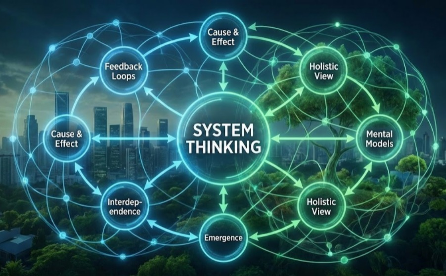

# UAS-1 My Concepts  
## Conceptual Transparency System: Mengangkat Ketidakberdayaan Manusia dalam Sistem Kompleks

### Masalah Kemanusiaan (Beban / B)

Di era Artificial Intelligence dan sistem digital yang semakin kompleks, manusia menghadapi satu masalah fundamental: **ketidakberdayaan dalam memahami dan mengendalikan sistem yang memengaruhi hidup mereka sendiri**.

Sistem sudah bekerja — aplikasi berjalan, algoritma memutuskan, kebijakan diterapkan — namun manusia sering kali:

- tidak memahami logika di balik keputusan sistem,
- tidak mampu menjelaskan apa yang sedang terjadi,
- dan akhirnya menyerahkan agensi mereka kepada teknologi.

Masalah ini bukan kegagalan teknologi, melainkan **beban kognitif dan komunikatif** yang terlalu berat bagi manusia.

Masalah ketidakberdayaan manusia dalam memahami dan mengendalikan sistem kompleks berbasis teknologi dan Artificial Intelligence merupakan masalah kemanusiaan lintas sektor yang memperparah berbagai tantangan global, termasuk ketidaksetaraan, keterbatasan akses pendidikan dan kesehatan, serta ketidakadilan sosial. 

Ketika sistem-sistem tersebut beroperasi tanpa transparansi konseptual yang memadai, manusia kehilangan agensi dalam mengambil keputusan yang secara langsung memengaruhi kehidupannya. Oleh karena itu, karya ini memposisikan diri pada akar permasalahan yang saling terhubung sebagaimana tercantum dalam Top-10 Masalah Kemanusiaan Dunia, **khususnya pada aspek ketidaksetaraan, akses pendidikan, dan kesehatan berbasis sistem.**

---

### Kekuatan yang Tersedia (K)

Di sisi lain, kita memiliki kekuatan besar:

- **Teknologi & AI** sebagai pengolah kompleksitas,
- **Pengetahuan sistem dan rekayasa**,
- **Komunikasi interpersonal dan publik** sebagai sarana penyelarasan makna,
- **Manusia sebagai pengambil keputusan bermakna**.

Masalahnya bukan ketiadaan kekuatan, melainkan **ketiadaan logika konseptual** yang mampu menghimpun kekuatan tersebut untuk mengangkat beban.

---

### Konsep Inti: Conceptual Transparency System (CTS)

Saya mengajukan **Conceptual Transparency System (CTS)** sebagai sebuah **konsep**, yaitu *logika mesin abstrak* yang bekerja dengan cara:

> menghimpun kekuatan teknologi, pengetahuan, dan komunikasi (K)  
> untuk mengangkat beban ketidakberdayaan manusia dalam sistem kompleks (B).

CTS tidak berusaha menyederhanakan teknologi, melainkan **membuat logika sistem menjadi transparan secara konseptual**, sehingga manusia dapat:

- memahami apa yang sedang terjadi,
- menjelaskan keputusan sistem,
- dan kembali memegang kendali makna.

---

### Mengapa Ini adalah Konsep (Bukan Sekadar Ide)

CTS adalah **induk dari ide-ide praktis**, karena darinya dapat “dibudidayakan”:

- peta pengetahuan sistem,
- kerangka komunikasi sistem,
- desain inovasi berbasis transparansi konseptual,
- produk pengetahuan yang dapat dipelajari publik.

Konsep ini berfungsi seperti **mesin abstrak**: tidak langsung digunakan, tetapi setelah dibangun, ia mampu terus membiakkan solusi baru.

---

### Nilai dan Kegunaan Publik

Konsep ini sangat aplikatif karena:

- membantu manusia memahami sistem tanpa harus menjadi teknisi,
- membantu perancang sistem melihat komunikasi sebagai komponen inti,
- membantu publik berpindah dari ketidakberdayaan menuju agensi.

Bagi saya, **konsep bukan hiasan akademik**, tetapi alat untuk mengangkat beban nyata manusia.
