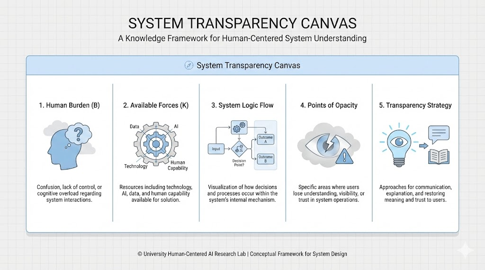

# UAS-3 My Innovations  
## System Transparency Canvas: Inovasi Nilai Berbasis Konsep

### Latar Belakang Inovasi

Banyak sistem gagal bukan karena teknologinya, tetapi karena **manusia tidak memahami cara sistem bekerja**. Berdasarkan konsep **Conceptual Transparency System**, saya merancang sebuah inovasi nilai berupa **System Transparency Canvas (STC)**.

---

### Deskripsi Inovasi

System Transparency Canvas adalah **produk pengetahuan** berbentuk kerangka visual dan konseptual yang membantu manusia:

- memahami logika sistem,
- mengomunikasikan keputusan,
- dan memulihkan agensi pengguna.

Canvas ini dapat digunakan di:

- pendidikan,
- organisasi,
- layanan publik,
- perancangan sistem berbasis AI.

---

### Komponen Canvas

1. **Beban (B)** – masalah manusia yang ingin diangkat  
2. **Kekuatan (K)** – teknologi, data, manusia, AI  
3. **Alur Sistem** – bagaimana keputusan dihasilkan  
4. **Titik Ketidakjelasan** – di mana manusia kehilangan pemahaman  
5. **Strategi Transparansi** – cara mengembalikan pemahaman & agensi  

---

### Nilai Guna & Kebaruan

- **Nilai Guna**: meningkatkan pemahaman dan kepercayaan manusia.
- **Kebaruan**: fokus pada transparansi konseptual, bukan fitur teknis.
- **Kelayakan**: dapat diterapkan tanpa infrastruktur mahal.
- **Dampak KIPP**: memperkuat komunikasi publik & interpersonal.

Inovasi ini menciptakan **nilai bersama**, karena dapat digunakan dan dikembangkan lintas konteks.

---

### Inovasi Nilai

STC bukan sekadar alat, tetapi **mekanisme penciptaan nilai pengetahuan** yang bisa “dibeli” di Knowledge Marketplace sebagai sumber belajar berkelanjutan.
