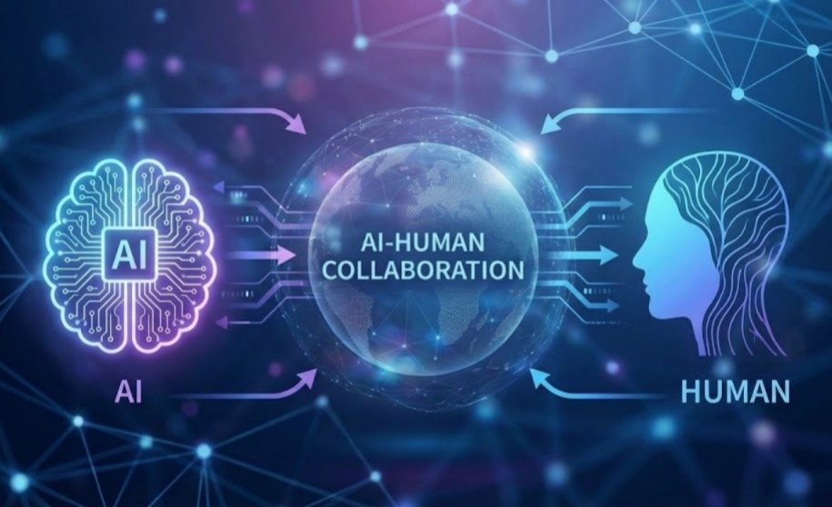

# UAS-2 My Opinions  
## AI Seharusnya Mengurangi Ketidakberdayaan Manusia, Bukan Memperparahnya

### Posisi Opini Saya

Opini ini saya ajukan dari sudut pandang **mahasiswa Sistem dan Teknologi Informasi** yang hidup dan belajar di tengah perkembangan AI. Ini adalah opini yang bersifat **semi-personal**, namun relevan untuk kepentingan publik.

---

### Opini Inti

Berdasarkan konsep **Conceptual Transparency System**, saya berpendapat bahwa:

> AI yang baik bukanlah AI yang paling cerdas,  
> melainkan AI yang **mengurangi ketidakberdayaan manusia**,  
> bukan menggantikannya.

---

### Dasar Opini (Rebusan Opini)

Opini ini terbentuk dari:

- **Informasi**: AI mampu mengambil keputusan kompleks secara cepat.
- **Pengalaman**: manusia sering tidak memahami keputusan sistem digital.
- **Nilai**: agensi manusia harus dipertahankan.
- **Perasaan**: kegelisahan saat manusia hanya menjadi “penonton” keputusan sistem.

---

### Sikap yang Saya Nilai Keliru

Ada dua ekstrem berbahaya:

1. Manusia menyerahkan seluruh keputusan kepada AI.
2. Manusia menolak AI tanpa memahami potensinya.

Keduanya mengabaikan kebutuhan utama: **transparansi konseptual**.

---

### Sikap yang Seharusnya Diambil

Manusia perlu:

- menggunakan AI sebagai alat eksplorasi dan refleksi,
- menuntut sistem yang dapat dijelaskan,
- dan bersedia mengubah opini ketika informasi baru hadir.

Saya siap merevisi pendapat ini jika di masa depan sistem AI benar-benar mampu meningkatkan agensi manusia secara konsisten dan terukur.

---

### Mengapa Opini Ini Penting

Keputusan publik — pendidikan, kesehatan, kebijakan — tidak boleh dibuat oleh sistem yang tidak dipahami manusia.

AI seharusnya:

- memperjelas pilihan,
- bukan mengaburkan tanggung jawab.

Inilah sikap yang menurut saya paling sehat di era AI.
